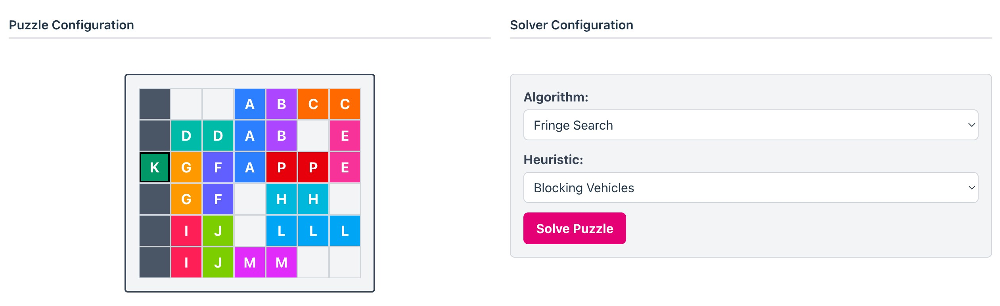

# IF2211 Strategi Algoritma - Tugas Kecil 3: Penyelesaian Puzzle Rush Hour Menggunakan Algoritma Pathfinding



## Description
Rush Hour adalah sebuah permainan puzzle logika berbasis grid yang menantang pemain untuk menggeser kendaraan di dalam sebuah kotak (biasanya berukuran 6x6) agar mobil utama (biasanya berwarna merah) dapat keluar dari kemacetan melalui pintu keluar di sisi papan. Setiap kendaraan hanya bisa bergerak lurus ke depan atau ke belakang sesuai dengan orientasinya (horizontal atau vertikal), dan tidak dapat berputar. Tujuan utama dari permainan ini adalah memindahkan mobil merah ke pintu keluar dengan jumlah langkah seminimal mungkin.

## Algorithm
1. Uniform Cost Search (UCS)
2. Greedy Best First Search (GBFS)
3. A* Algorithm
4. Fringe Search

## Heuristic Function
1. Blocking Cells
2. Blocking Vehicles
3. Manhattan Distance

## How to Run
1. Clone the Repository
    ```
    git clone https://github.com/Incheon21/Tucil3_13523029_13523033.git
    ```
2. Switch to Src Directory
    ```
    cd src
    ```
3. Install Dependencies
    ```
    npm install
    ```
4. Run the Project
    ```
    npm run dev
    ```

## Author
| NIM  | Nama |
|------|------|
| 13523029 | Bryan Ho |
| 13523033 | Alvin Christopher Santausa |